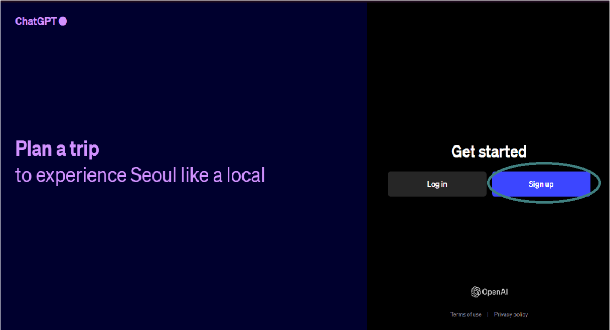
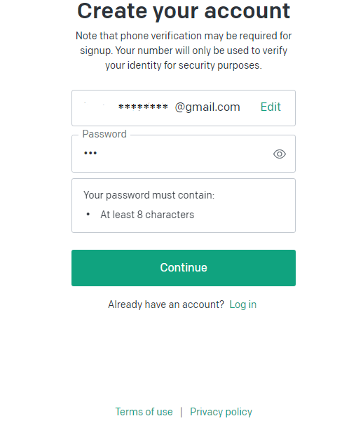
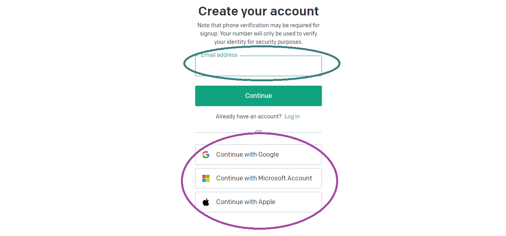
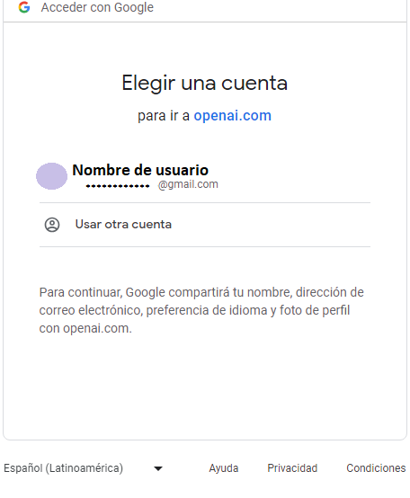
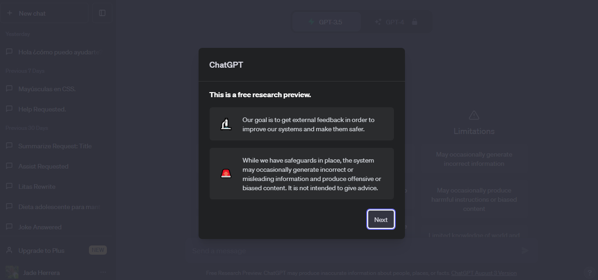
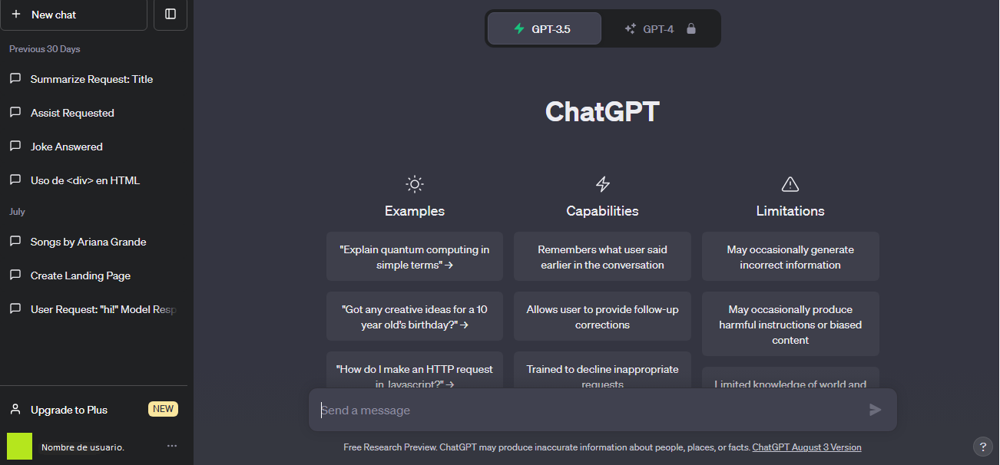
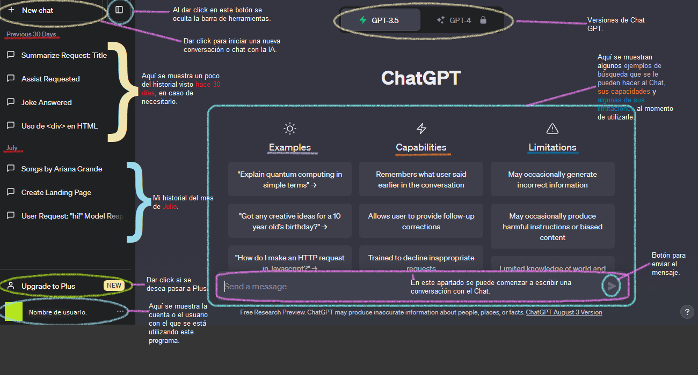

# ¿Cómo crearme una cuenta en Chat GPT?

Para este curso es importante tener una cuenta el Chat GPT, ya que será una de nuestras herramientas principales.

[Da click aquí para ir a Chat GPT](https://chat.openai.com/auth/login)

---
### Crear mi cuenta en Chat GPT.

Una vez ue se haya ingresado en el link proporcionado en la parte de arriba, aparecerá una pantalla como esta.

Cuando se tenga este menú en la pantalla hay que dar click en Sign up (Inscribirse).

Una vez que se de click a ese botón, aparecerá una pantalla con la opción de colocar un correo electrónico. 
También puedes solamente continuar con tu cuenta de google, microsoft o apple según sea tu preferencia.

---

#### _Continuar con un correo electrónico._

Si ingresas tu correo electrónico deberán elegir una contraseña de 8 caracteres con al menos un símbolo y algunos números para una mayor seguridad.

---

#### _Continuar con cuenta de google o demás._

En caso de continuar con alguna cuenta ya creada, en la pantalla hay que dar click en continuar con; Cuenta de google, Cuenta de Microsoft o con Apple según sea el caso.

Ua vez dado el click se deberá elegir la cuenta con la que se desea continuar.

##### Ya ejecutados los pasos anteriores.
Te aparecerá una pantalla similar a la siguiente...

Esta es una interfaz en la que solamente deberás ir dando click a next (siguiente) una vez leído el contenido.

Una vez finalizado ese proceso hay es reelevante conocer la barra de herramientas y la pantalla principal de Chat GPT.

---

### Barra de herramientas y pantalla principal de Chat GPT.

Como pantalla principal tendremos algo similar a esto.

En esta pantalla encontraremos del lado izquierdo de la pantalla una serie de herramientas para usar de forma más eficienta Chat GPT, entre ellas se encuentran; Historial, cuenta del usuario, iniciar nuevo chat y ajustes más avanzados. 

---