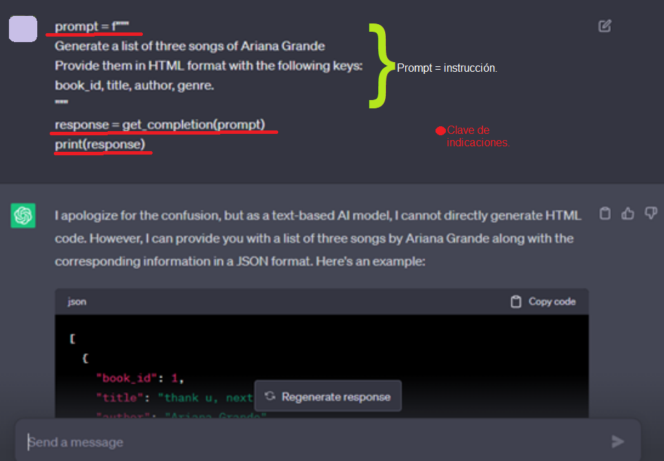
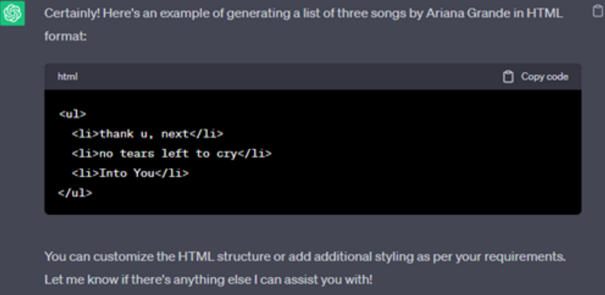
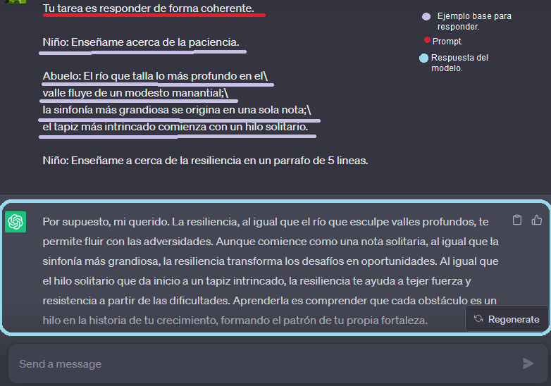
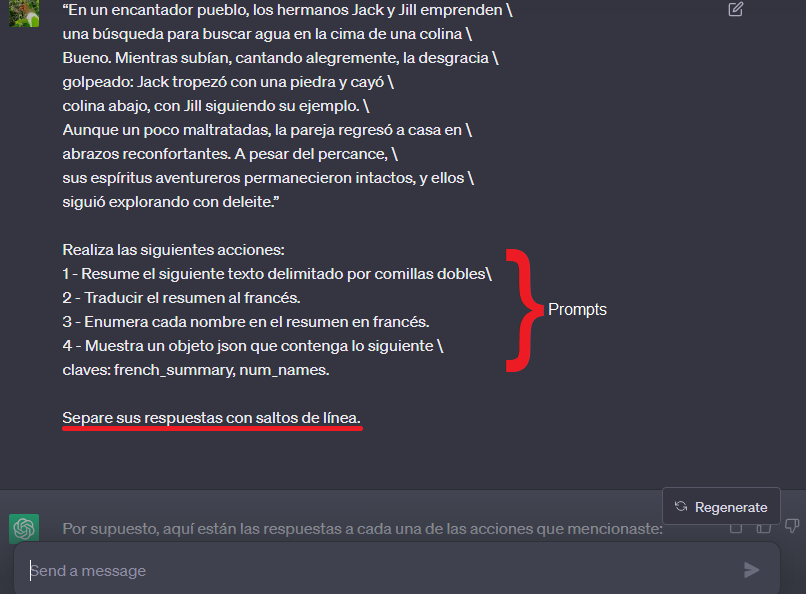
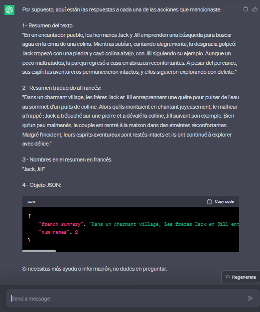

# Demostración de tácticas e instrucciones.

A esta instrucción, el modelo da como resultado una lista pero en código HTML como se le indicó en la instrucción que se encuentra dentro de la llave color verde en la imágen anterior.

---

### Ejemplo de la táctica 4. 

Dar buenos ejemplos base para que el modelo tenga una idea de cómo responder o llevar a cabo su tarea.

---

### Ejemplo.

_"Dividir la tarea en pasos para darle al modelo más tiempo para pensar puede ser de ayuda"._

**_PROMPT_**

**_RESULTADO_**

---

>Estos son tan solo algunos ejemplos de lo que se puede hacer con prompt engineering, espero te sean útiles para comprender aun más las claves para poder llevarlo a la práctica.